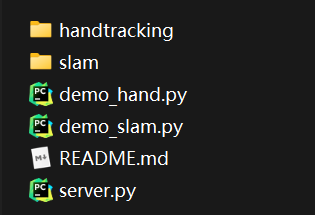

# socket-server使用说明

- handtracking文件夹: 手势识别SDK, 存放动态库及接口封装文件

- slam文件夹: 空间锚点SDK, 存放动态库及接口封装文件

- demo_hand.py: 调用手势识别接口的demo脚本

- demo_slam.py: 调用空间锚点接口的demo脚本
- server.py: websocket服务器, 负责推送slam或hand数据给前端

